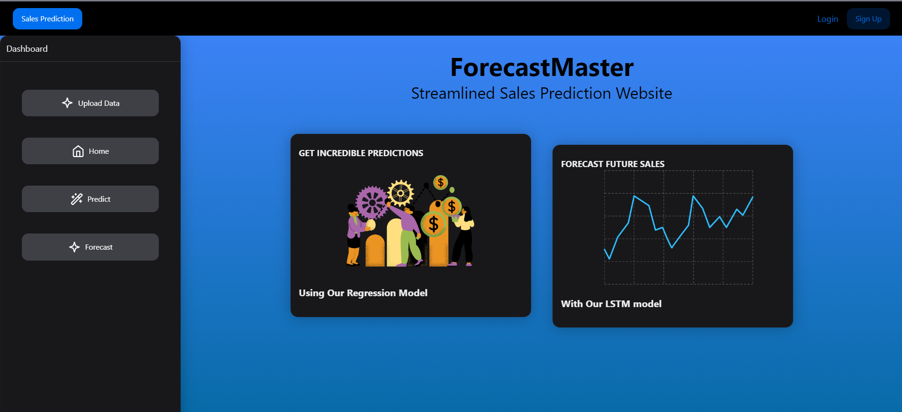

# SaleSage

This project leverages machine learning to provide accurate sales forecasts and predictions, empowering businesses with data-driven insights.

Built with React for an intuitive front-end and Flask for a robust back-end, the system integrates Long Short-Term Memory [(LSTM)](https://pytorch.org/docs/stable/generated/torch.nn.LSTM.html) networks for future sales forecasting and [XGBoost](https://xgboost.readthedocs.io/en/stable/) for precise sales predictions.

## 🚀 Introduction
Understanding future sales trends is crucial for strategic decision-making. This project helps businesses make informed choices by analyzing historical sales data and applying advanced ML models to generate accurate forecasts.

## ✨ Key Features
- 📊 **Future Sales Forecasting**: LSTM networks predict upcoming sales trends based on historical data.
- 📈 **Sales Prediction**: XGBoost provides accurate short-term sales predictions.
- 🖥️ **User-Friendly Interface**: Built with React, offering an intuitive and responsive UI.
- 🔗 **RESTful API**: Powered by Flask, handling data processing and model inference efficiently.

## 🖼 Preview
| Home Page | Upload Data | Prediction Results | Past Sales | Future Sales |
|-----------|------------|--------------------|------------|--------------|
|  | |  |  |  |

## 🛠 Technologies Used

### Front-End
- React (for UI)
- Axios (API requests)
- Chart.js (data visualization)
- NextUI Library

### Back-End
- Flask
- Flask-RESTful
- Flask-CORS

### Machine Learning
- TensorFlow/Keras (LSTM models)
- XGBoost
- Pandas
- Scikit-learn

## 🔧 Installation Guide

### Prerequisites
- Node.js and npm installed
- Python 3.7+
- Virtualenv for dependency management

## 🤝 Contributing
We welcome contributions to improve this project and look forward to collaborating with you!
